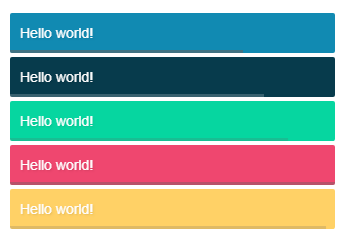
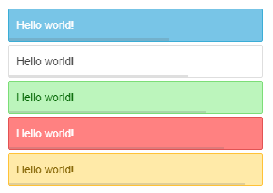
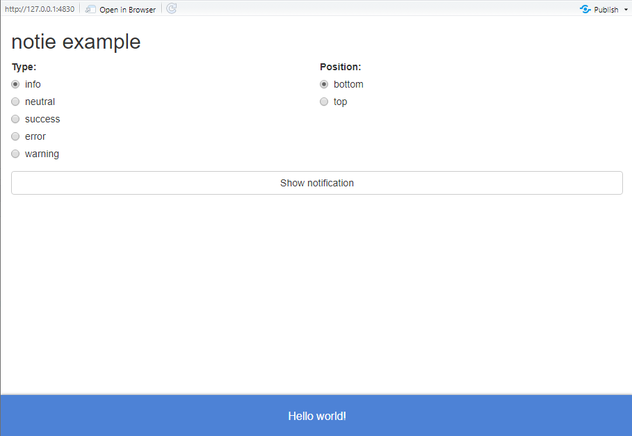
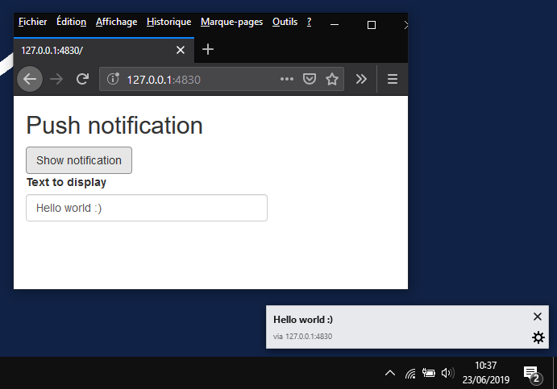
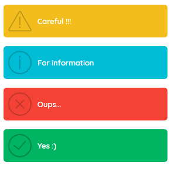
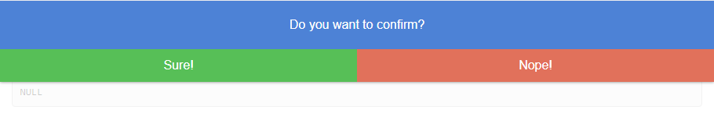
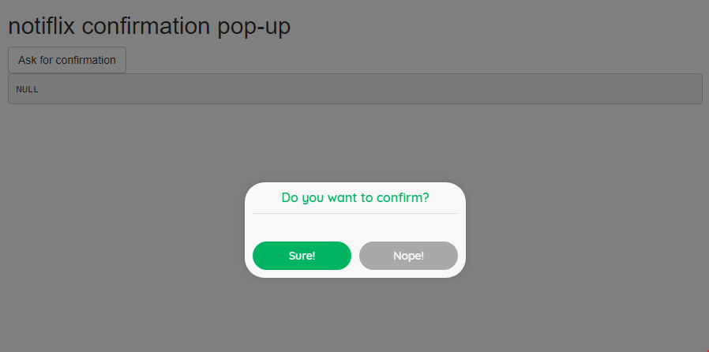
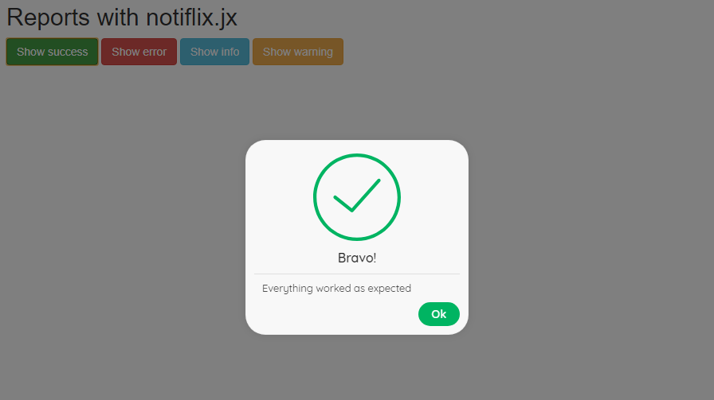

# shinypop

[](https://www.repostatus.org/#active)

> Collection of notifications and dialogs for Shiny applications

## Installation

You can install dev version from GitHub:

``` r
remotes::install_github("dreamRs/shinypop")
```

## Notifications

Notifications libraries included :

  * noty : https://github.com/needim/noty
  * notie : https://github.com/jaredreich/notie
  * push : https://github.com/Nickersoft/push.js
  * notiflix : https://github.com/notiflix/Notiflix

### noty

Notfications with various themes and options to configure :

```r
ui <- fluidPage(
  tags$h2("noty example"),
  use_noty(),
  actionButton(
    inputId = "show",
    label = "Show notification"
  )
)

server <- function(input, output, session) {
  
  observeEvent(input$show, {
    noty(text = "Hello world!", type = "info")
  })
  
}

shinyApp(ui, server)
```





### notie

Top or bottom fuul width notifications :

```r
ui <- fluidPage(
  tags$h2("notie example"),
  use_notie(),
  actionButton(
    inputId = "show",
    label = "Show notification",
    width = "100%"
  )
)

server <- function(input, output, session) {

  observeEvent(input$show, {
    notie(
      text = "Hello world!",
      type = "info", 
      position = "bottom"
    )
  })

}

shinyApp(ui, server)
```




### push

push.js allow to create desktop notification (outside the browser), user must allow this type of notification.

```r
ui <- fluidPage(
  tags$h2("Push notification"),
  use_push(),
  actionButton("show", "Show notification"),
  textInput("title", "Text to display", "Hello world :)")
)

server <- function(input, output, session) {
  
  observeEvent(input$show, {
    push(title = input$title)
  })
  
}

shinyApp(ui, server)
```




### notiflix

Fully configurable notifications :

```r
ui <- fluidPage(
  tags$h2("Notification with notiflix.jx"),
  use_notiflix_notify(position = "right-bottom"),
  actionButton("success", "Show success", class = "btn-success"),
  actionButton("error", "Show error", class = "btn-danger"),
  actionButton("info", "Show info", class = "btn-info"),
  actionButton("warning", "Show warning", class = "btn-warning")
)

server <- function(input, output, session) {

  observeEvent(input$success, {
    nx_notify_success("Yes :)")
  })

  observeEvent(input$error, {
    nx_notify_error("Oups...")
  })

  observeEvent(input$info, {
    nx_notify_info("For information")
  })

  observeEvent(input$warning, {
    nx_notify_warning("Careful !!!")
  })

}

shinyApp(ui, server)
```




## Confirmation dialogs

Confirmation dialogs can be done with : 

  * notie : https://github.com/jaredreich/notie
  * notiflix : https://github.com/notiflix/Notiflix


### notie

Ask user confirmation : 


```r
ui <- fluidPage(
  use_notie(),
  tags$h2("notie.js confirmation pop-up"),
  actionButton("show", "Ask for confirmation"),
  verbatimTextOutput("result")
)

server <- function(input, output, session) {

  observeEvent(input$show, {
    notie_confirm(
      inputId = "confirm",
      text = "Do you want to confirm?",
      label_submit = "Sure!",
      label_cancel = "Nope!"
    )
  })

  output$result <- renderPrint({
    input$confirm
  })
}

shinyApp(ui, server)
```




### notiflix

Ask user confirmation : 


```r
ui <- fluidPage(
  use_notiflix_confirm(),
  tags$h2("notiflix confirmation pop-up"),
  actionButton("show", "Ask for confirmation"),
  verbatimTextOutput("result")
)

server <- function(input, output, session) {
  
  observeEvent(input$show, {
    nx_confirm(
      inputId = "confirm",
      title = "Do you want to confirm?",
      button_ok = "Sure!",
      button_cancel = "Nope!"
    )
  })
  
  output$result <- renderPrint({
    input$confirm
  })
}

shinyApp(ui, server)
```





## Alerts

For alerts you can use :

* notiflix : https://github.com/notiflix/Notiflix


### notiflix

Show an alert :

```r
ui <- fluidPage(
  tags$h2("Reports with notiflix.jx"),
  use_notiflix_report(),
  actionButton("success", "Show success", class = "btn-success")
)

server <- function(input, output, session) {

  observeEvent(input$success, {
    nx_report_success("Bravo!", "Everything worked as expected")
  })

}

shinyApp(ui, server)
```




## Related packages

Those packages include similar functionnalities :

 * [`shinyalert`](https://github.com/daattali/shinyalert) allow to use [sweetalert](https://github.com/t4t5/sweetalert)
 * [`shinyWidgets`](https://github.com/dreamRs/shinyWidgets) allow to use [sweetalert2](https://github.com/sweetalert2/sweetalert2)
 * [`shinytoastr`](https://github.com/MangoTheCat/shinytoastr) allow to use [toastr](https://github.com/CodeSeven/toastr)


